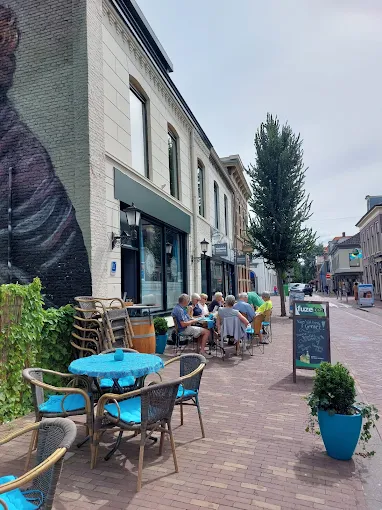

# Bistro Joy'Si — website

Deze map bevat een complete, statische website: `index.html`, `style.css`, `script.js`.
Geen build-tools nodig — gewoon uploaden naar hosting en klaar.

## Wat is al ingevuld (op basis van openbare gegevens)
- Adres: Van Tolstraat 19, 2411 BP Bodegraven
- Telefoon: 0172 - 793 412
- E-mail: bistrojoysi@gmail.com
- Openingstijden: wo 11:00–23:00, do 16:00–23:00, vr–za 11:00–23:00, zo–di gesloten
- KvK-nummer: 77954734
- Verhaal: geopend in 2021 door Joyce de Lange, tekeningen van haar vader (1990) aan de muur
- Social links naar Facebook/Instagram (@bistrojoysi)
- Google-beoordeling: 4,9/5

**Controleer deze gegevens nog even zelf** voordat je live gaat — openingstijden
van horeca wijzigen weleens, en dit zijn gegevens die ik via openbare bronnen
(Google, restaurantsites) heb gevonden, niet rechtstreeks van jullie eigen systeem.

## Wat je nog moet aanvullen vóór livegang

1. **Foto's** — de zes kaders bij "Sfeerbeelden" zijn nu nette placeholders
   (met opschrift, zoals "Het terras", "Borrelplank"). Zet in de map `images/`
   jullie eigen foto's (het terras, gerechten, de muur met tekeningen) en
   vervang in `index.html` elk leeg placeholder-vakje:

   ```html
   <figure class="photo-tile tile-a" data-caption="Het terras"></figure>
   ```

   door een vakje met een echte foto en bijschrift:

   ```html
   <figure class="photo-tile tile-a">
     
     <figcaption>Het terras</figcaption>
   </figure>
   ```

   Gebruik foto's van min. 1200px breed. De stijl (bijgesneden vullen van het
   vakje + bijschrift-overlay) staat al klaar in `style.css`.

2. **Menukaart** — de indeling (Koffie, Lunch, Borrel, Diner, High tea) staat
   klaar, maar de gerechten en prijzen (`€ –`) zijn voorbeelden. Vervang deze
   door jullie actuele kaart in de `<ul class="menu-list">`-blokken.

3. **Reviews** — de drie testimonials zijn representatieve voorbeeldteksten,
   geen letterlijke citaten. Vervang ze door echte, met toestemming gedeelde
   reviews van gasten (bijv. gekopieerd uit jullie Google Bedrijfsprofiel).

4. **Favicon / og-afbeelding** (optioneel) — voeg een `favicon.ico` en een
   deelafbeelding toe voor als de link op social media wordt gedeeld.

## Live zetten
De site is een simpele set statische bestanden. Opties:
- **Makkelijkst:** upload de hele map naar Netlify, Vercel of GitHub Pages (allemaal gratis).
- **Eigen hosting:** upload `index.html`, `style.css`, `script.js` en de map
  `images/` via FTP naar jullie hostingpakket (bijv. bij de huidige domeinregistrar).
- Zorg dat het domein (bijv. bistrojoysi.nl) naar deze bestanden wijst.

## Techniek
- Geen frameworks, geen dependencies — puur HTML/CSS/JS.
- Responsive vanaf mobiel tot desktop.
- Kaart onderaan gebruikt een gratis Google Maps-embed (geen API-key nodig).
- Lettertypes (Fraunces, Public Sans, Caveat) worden via Google Fonts geladen.
